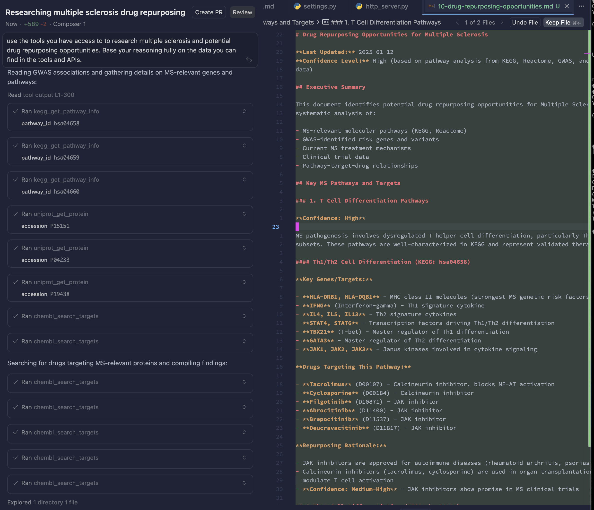

# Biological APIs MCP Server

MCP server that integrates multiple biological and medical databases for research purposes.

## APIs Integrated

### ✅ Implemented APIs

- **Reactome API** - Pathway information, gene/protein queries, disease associations
- **KEGG API** - Pathway maps, gene annotations, disease and drug information
- **UniProt API** - Protein sequences, functional annotations, disease associations
- **OMIM API** - Genetic disease information, gene-disease associations (requires API key)
- **GWAS Catalog API** - Genetic associations, variant information, study metadata
- **Pathway Commons API** - Integrated pathway data, pathway interactions, gene/protein networks
- **Node Normalization API** - CURIE normalization, identifier mapping across databases
- **ChEMBL API** - Drug-target interactions, bioactivity data, mechanisms of action, drug
  indications
- **ClinicalTrials.gov API** - Clinical trial search, study metadata, trial status



See [API_PLAN.md](./API_PLAN.md) for detailed information.

## Installation

```bash
# Install dependencies using uv
cd /path/to/medical-mcps
uv sync
```

## Running the Server

The server uses **Streamable HTTP** transport (per
[MCP specification](https://modelcontextprotocol.io/specification/2025-03-26/basic/transports#streamable-http))
for remote hosting over HTTP.

After running `uv sync`, you can run the server:

### Using Makefile (Recommended for Development)

```bash
# Start server with uvicorn and livereload (auto-reload on code changes)
make server
```

### Using uv directly

```bash
# Run HTTP server
uv run mcp-server

# Or with custom host/port
MCP_HOST=0.0.0.0 MCP_PORT=8000 uv run mcp-server
```

### Using uvicorn directly

```bash
# Run with uvicorn and livereload
uv run uvicorn medical_mcps.http_server:app --reload --host 0.0.0.0 --port 8000
```

The HTTP server will be available at `http://localhost:8000` (or your configured host/port).

The server uses the MCP SDK's Streamable HTTP transport mounted as an ASGI app on FastAPI. The MCP
endpoint is available at `/mcp` and supports both POST (for sending JSON-RPC messages) and GET (for
optional SSE streams).

## Connecting to Production

The MCP servers are deployed and available at:

**Production URL:** `https://medical-mcps-production.up.railway.app`

### Configuring MCP Clients

Each API is available at its own endpoint. Configure your MCP client (e.g., Cursor) to use either
the production deployment or a local instance:

**Production (Recommended):**

```json
{
  "url": "https://medical-mcps-production.up.railway.app/tools/reactome/mcp"
}
```

**Local Development:**

```json
{
  "url": "http://localhost:8000/tools/reactome/mcp"
}
```

### Available Endpoints

All endpoints are available at both production and local URLs:

- `/tools/reactome/mcp` - Reactome API
- `/tools/kegg/mcp` - KEGG API
- `/tools/uniprot/mcp` - UniProt API
- `/tools/omim/mcp` - OMIM API
- `/tools/gwas/mcp` - GWAS Catalog API
- `/tools/pathwaycommons/mcp` - Pathway Commons API
- `/tools/nodenorm/mcp` - Node Normalization API
- `/tools/chembl/mcp` - ChEMBL API
- `/tools/ctg/mcp` - ClinicalTrials.gov API

### Example: Configuring Multiple APIs in Cursor

To use multiple APIs, add separate MCP server entries in your Cursor configuration
(`.cursor/mcp.json`):

```json
{
  "mcpServers": {
    "reactome": {
      "url": "https://medical-mcps-production.up.railway.app/tools/reactome/mcp"
    },
    "chembl": {
      "url": "https://medical-mcps-production.up.railway.app/tools/chembl/mcp"
    },
    "kegg": {
      "url": "https://medical-mcps-production.up.railway.app/tools/kegg/mcp"
    }
  }
}
```

### Testing the Connection

You can test if the production server is accessible by making a simple HTTP request:

```bash
# Test Reactome endpoint
curl https://medical-mcps-production.up.railway.app/tools/reactome/mcp \
  -X POST \
  -H "Content-Type: application/json" \
  -d '{"jsonrpc": "2.0", "method": "initialize", "params": {}, "id": 1}'
```

A successful response indicates the server is running and accessible.

## HTTP Caching

All API clients use **hishel** (RFC 9111 compliant HTTP caching) to transparently cache responses to
disk. This reduces redundant API calls and improves performance.

### Cache Configuration

- **Cache Location**: `~/.cache/medical-mcps/api_cache/`
- **Cache Duration**: 30 days (default TTL)
- **Cache Refresh**: TTL is reset when accessing cached entries (`refresh_ttl_on_access=True`)
- **Per-API Cache Files**: Each API has its own SQLite cache file (e.g., `reactome.db`, `kegg.db`)

### Cache Behavior

- **Automatic**: Caching is enabled by default for all HTTP-based APIs
- **Transparent**: Responses are cached automatically based on URL, parameters, and headers
- **RFC 9111 Compliant**: Respects HTTP caching semantics and Cache-Control headers
- **Cache Visibility**: Logs show "(from cache)" when serving cached responses

### Disabling Caching

To disable caching for a specific client, pass `enable_cache=False` when initializing:

```python
client = ReactomeClient(enable_cache=False)
```

### Clearing Cache

To clear the cache, delete the cache directory:

```bash
rm -rf ~/.cache/medical-mcps/api_cache/
```

Or delete individual API cache files:

```bash
rm ~/.cache/medical-mcps/api_cache/reactome.db
```

### Supported APIs

All HTTP-based APIs support caching:

- Reactome (httpx)
- KEGG (httpx)
- UniProt (httpx)
- OMIM (httpx)
- GWAS Catalog (httpx)
- Pathway Commons (httpx)
- ClinicalTrials.gov (requests)

**Note**: ChEMBL uses a library client (not HTTP), so caching is handled at the library level.

## Monitoring with Sentry

The server includes optional [Sentry](https://sentry.io) integration for error tracking and
performance monitoring. Sentry automatically instruments MCP tool executions, prompt requests, and
resource access.

### Setup

1. Get your Sentry DSN from [sentry.io](https://sentry.io)
2. Set the `SENTRY_DSN` environment variable:

```bash
export SENTRY_DSN="https://your-dsn@sentry.io/project-id"
```

### Configuration

Sentry can be configured via environment variables:

- `SENTRY_DSN` - Your Sentry DSN (required to enable Sentry)
- `SENTRY_TRACES_SAMPLE_RATE` - Sample rate for performance traces (default: `1.0` = 100%)
- `SENTRY_SEND_DEFAULT_PII` - Include tool inputs/outputs in Sentry (default: `true`)
- `SENTRY_ENABLE_LOGS` - Enable sending logs to Sentry (default: `true`)
- `SENTRY_PROFILE_SESSION_SAMPLE_RATE` - Sample rate for profiling sessions (default: `1.0` = 100%)
- `SENTRY_PROFILE_LIFECYCLE` - Profiler lifecycle mode (default: `trace` - auto-run when transaction
  active)
- `ENVIRONMENT` - Environment name (default: `local`)

**Performance Monitoring:**

- **Tracing**: Captures 100% of transactions by default (`traces_sample_rate=1.0`)
- **Profiling**: Profiles 100% of sessions by default (`profile_session_sample_rate=1.0`)
- **Logs**: Enabled by default (`enable_logs=True`)

### What Gets Tracked

Sentry automatically collects:

**MCP Integration:**

- **Tool executions**: Tool name, arguments, results, and execution errors
- **Prompt requests**: Prompt name, arguments, and content
- **Resource access**: Resource URI and access patterns
- **Request context**: Request IDs, session IDs, and transport types
- **Execution spans**: Timing information for all handler invocations

**Starlette Integration:**

- **HTTP requests**: Method, URL, headers, form data, JSON payloads
- **Errors**: All exceptions leading to Internal Server Error (5xx status codes)
- **Performance**: Request timing and transaction data
- **Request data**: Attached to all events (excludes PII unless `send_default_pii=True`)

**HTTPX Integration:**

- **Outgoing HTTP requests**: All HTTP requests made by API clients (Reactome, KEGG, UniProt, etc.)
- **Request spans**: Creates spans for each outgoing HTTP request
- **Trace propagation**: Ensures traces are properly propagated to downstream services

**Asyncio Integration:**

- **Async operations**: Tracks async context and operations
- **Async errors**: Captures errors in async functions and tasks

### Privacy

By default, Sentry does **not** include tool inputs/outputs or prompt content (considered PII). To
include this data, set `SENTRY_SEND_DEFAULT_PII=true`.

See the
[Sentry MCP integration documentation](https://docs.sentry.io/platforms/python/integrations/mcp/)
for more details.

## API Key Handling

**Important:** The MCP server is a **stateless proxy**. It does NOT store API keys.

### APIs Requiring Client-Provided API Keys

For APIs that require authentication (currently **OMIM**), the MCP client must provide the API key
as a parameter with each tool call:

```json
{
  "jsonrpc": "2.0",
  "method": "tools/call",
  "params": {
    "name": "get_entry",
    "arguments": {
      "mim_number": "104300",
      "api_key": "your-omim-api-key-here"
    }
  }
}
```

**APIs requiring API keys:**

- **OMIM** - All tools require `api_key` parameter (get from https://omim.org/api)

**APIs not requiring API keys:**

- Reactome, KEGG, UniProt, GWAS Catalog, Pathway Commons, Node Normalization, ChEMBL,
  ClinicalTrials.gov

### Pattern for Future APIs

If a new API requires authentication, follow this pattern:

1. Add `api_key: str` as a **required parameter** to all tools
2. Validate API key presence before making API calls
3. Return clear error message if key is missing:
   `"Error: API key is required. Get your API key from <url>"`
4. Create client instance per-request with provided key: `client = APIClient(api_key=api_key)`
5. **DO NOT** store API keys in server settings or environment variables

Example:

```python
@api_mcp.tool()
async def some_tool(param: str, api_key: str) -> str:
    """Tool description.

    Args:
        param: Required parameter
        api_key: API key (REQUIRED - get from https://api-provider.com)
    """
    if not api_key:
        return "Error: API key is required. Get your API key from https://api-provider.com"

    try:
        client = APIClient(api_key=api_key)
        return await client.some_method(param)
    except Exception as e:
        return f"Error calling API: {str(e)}"
```

## Available Tools

All tools are prefixed with the API name (e.g., `reactome_*`) to make it clear which API is being
used.

### Reactome Tools

- `reactome_get_pathway` - Get detailed pathway information
- `reactome_query_pathways` - Query pathways by keyword or gene/protein name
- `reactome_get_pathway_participants` - Get all participants in a pathway
- `reactome_get_disease_pathways` - Get pathways associated with a disease

### KEGG Tools

- `kegg_get_pathway_info` - Get pathway information by pathway ID
- `kegg_list_pathways` - List pathways (optionally filtered by organism)
- `kegg_find_pathways` - Find pathways matching a query keyword
- `kegg_get_gene` - Get gene information by gene ID
- `kegg_find_genes` - Find genes matching a query keyword
- `kegg_get_disease` - Get disease information by disease ID
- `kegg_find_diseases` - Find diseases matching a query keyword
- `kegg_link_pathway_genes` - Get genes linked to a pathway

### UniProt Tools

- `uniprot_get_protein` - Get protein information by accession
- `uniprot_search_proteins` - Search proteins in UniProtKB
- `uniprot_get_protein_sequence` - Get protein sequence in FASTA format
- `uniprot_get_disease_associations` - Get disease associations for a protein
- `uniprot_map_ids` - Map identifiers between databases

### OMIM Tools

- `omim_get_entry` - Get entry information by MIM number
- `omim_search_entries` - Search entries in OMIM
- `omim_get_gene` - Get gene information by gene symbol
- `omim_search_genes` - Search genes in OMIM
- `omim_get_phenotype` - Get phenotype information by MIM number
- `omim_search_phenotypes` - Search phenotypes in OMIM

**Note:** All OMIM tools require an `api_key` parameter. Get your API key from https://omim.org/api

### GWAS Catalog Tools

- `gwas_get_association` - Get association information by association ID
- `gwas_search_associations` - Search for associations with various filters
- `gwas_get_variant` - Get SNP information by rsId
- `gwas_search_variants` - Search for SNPs/variants by rsId
- `gwas_get_study` - Get study information by study ID
- `gwas_search_studies` - Search for studies with various filters
- `gwas_get_trait` - Get trait information by trait ID
- `gwas_search_traits` - Search for traits

### Pathway Commons Tools

- `pathwaycommons_search` - Search for pathways, proteins, or other biological entities
- `pathwaycommons_get_pathway_by_uri` - Get pathway information by URI
- `pathwaycommons_top_pathways` - Get top-level pathways (optionally filtered by gene or datasource)
- `pathwaycommons_graph` - Get pathway graph/network (neighborhood, paths, etc.)
- `pathwaycommons_traverse` - Traverse pathway data using graph path expressions

### Node Normalization Tools

- `get_semantic_types` - Get all supported BioLink semantic types
- `get_curie_prefixes` - Get all supported CURIE prefixes
- `get_normalized_nodes` - Normalize one or more CURIEs to get equivalent identifiers
- `get_allowed_conflations` - Get available conflation types

### ChEMBL Tools

- `chembl_get_molecule` - Get molecule (drug/compound) information by ChEMBL ID
- `chembl_search_molecules` - Search molecules by name or synonym
- `chembl_get_target` - Get target (protein) information by ChEMBL ID
- `chembl_search_targets` - Search targets by name or synonym
- `chembl_get_activities` - Get bioactivity data (filter by target or molecule)
- `chembl_get_mechanism` - Get mechanism of action for a molecule
- `chembl_find_drugs_by_target` - Find all drugs targeting a specific protein
- `chembl_find_drugs_by_indication` - Find all drugs for a disease/indication
- `chembl_get_drug_indications` - Get all indications for a specific drug

### ClinicalTrials.gov Tools

- `ctg_search_studies` - Search clinical trials with various filters
- `ctg_get_study` - Get single study by NCT ID
- `ctg_search_by_condition` - Search trials by condition/disease
- `ctg_search_by_intervention` - Search trials by intervention/treatment
- `ctg_get_study_metadata` - Get data model metadata (available fields)

## Development

The server is structured as:

```
medical_mcps/
├── __init__.py
├── http_server.py         # HTTP MCP server (Starlette)
├── settings.py            # Server configuration
├── api_clients/           # API client implementations
│   ├── __init__.py
│   ├── base_client.py
│   ├── reactome_client.py
│   ├── kegg_client.py
│   ├── uniprot_client.py
│   ├── omim_client.py
│   ├── gwas_client.py
│   ├── pathwaycommons_client.py
│   ├── nodenorm_client.py
│   ├── chembl_client.py
│   └── ctg_client.py
└── servers/               # Individual MCP servers per API
    ├── __init__.py
    ├── reactome_server.py
    ├── kegg_server.py
    ├── uniprot_server.py
    ├── omim_server.py
    ├── gwas_server.py
    ├── pathwaycommons_server.py
    ├── nodenorm_server.py
    ├── chembl_server.py
    ├── ctg_server.py
    └── unified_server.py
```

To add a new API:

1. Create a new client in `api_clients/` (e.g., `newapi_client.py`)
2. Create a new server in `servers/` (e.g., `newapi_server.py`)
3. Register the server in `http_server.py` (import, mount, and lifespan)
4. Follow the naming convention: `{api_name}_{tool_name}` for tools

## Testing

Test the server by connecting an MCP client and calling the tools. Each tool response includes the
API source in the output.
